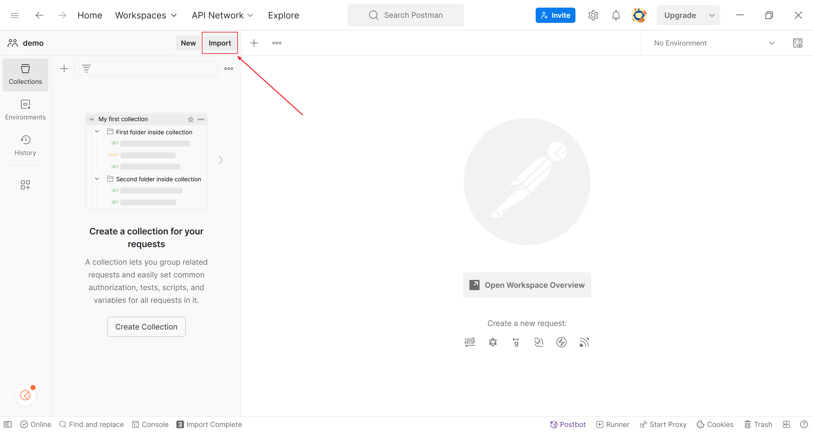
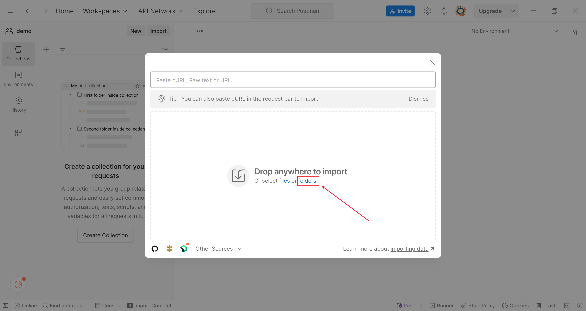
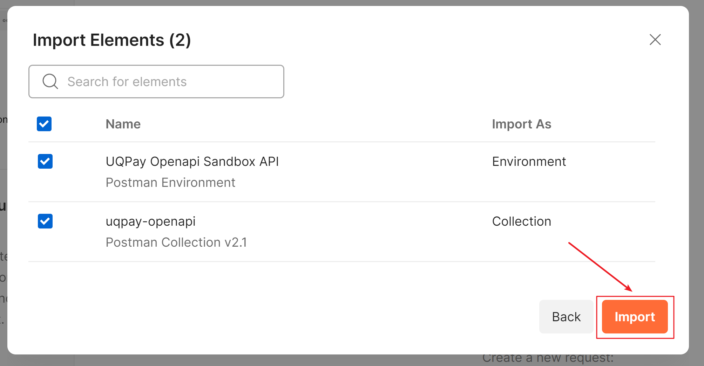
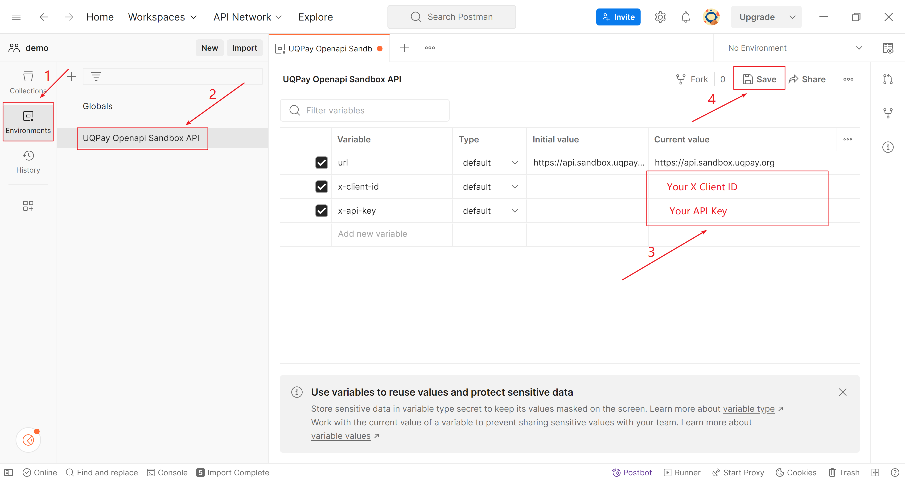
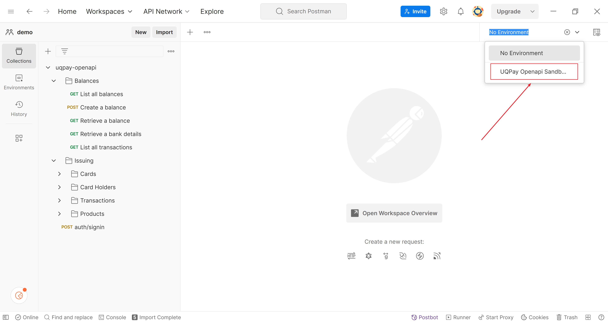

# UQPAY API Postman
[Postman](https://www.postman.com) 是一个API合作平台。

为了便于用户快速方便的使用 RESTful APIs，Uqpay 提供几个 Postman Collections 和 Environments 文件(JSON文件)。 
只需要导入并设置自己的 API 密钥就能即可开始。

## 如何导入和配置
- 下载 `uqpay-api-postman` 存储库到本地。

- 单击 `Import` 按钮。 例如，在 Windows 版 Postman 上，按钮位于左上角。
  

- 在 `Import` 弹出页面上，单击 `folders` 按钮，然后选择下载存储库的根文件夹。
  

- 选择要导入的 collections 和 environments，然后单击 `Import` 按钮。
  

- 选择左侧的 `Environments` 选项卡，选择一个 environment，在 `Current value` 的列上设置您的 Client ID 和 X Api Key(参见截图)。
  设置完值后，一定要记得单击右上角的 `Save` 按钮保存。
  

- 从环境下拉列表中选择新添加的 environment。在 Windows 上，它位于右上角。
  

## Postman 安全实践
为了确保账户安全，建议采取以下最佳安全实践：

- 不要使用从未知来源获得的 Postman Collections。
- 在使用前要检查好 Environment JSON 文件。
- 不要使用任何你不理解的代码。
- 使用完 API 端点后，删除所有的 API 密钥。

## 常见问题
**Q:** 为什么我得不到任何回应？

检查是否已导入 environment 设置并从列表中选择对应的 environment。请按照上面的步骤设置好你的 environment。

**Q:** 如何 debug 或者怎么查看请求的 URL ？

- 在 Postman 的控制台内能看到每一个请求打印出的参数和 URL 。
- 可以通过编辑 `Pre-request Script` 选项卡做调试。

## 有疑问
可以在此存储库提供 [`issue`](https://github.com/uqpay/uqpay-api-postman/issues).